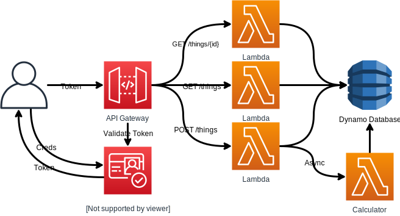

# CDK Cognito, Lambda, Dynamo API



## Setup

  1. Install CDK globally: `npm install -g aws-cdk`
  2. Install local Node.js dependencies: `npm install`
  3. Build the project: `npm run build`
  4. Bootstrap the CDK Toolkit into your AWS account: `cdk bootstrap`
  5. Deploy the stack: `cdk deploy -c image-tag=[latest|plain-text]`

## Useful Commands

  * `npm run build` compile project to `dist`
  * `npm run clean` delete everything in `cdk.out` and `dist`
  * `npm run watch` watch for changes and compile
  * `cdk deploy` deploy this stack to your default AWS account/region
  * `cdk diff` compare deployed stack with current state
  * `cdk synth` emits the synthesized CloudFormation template


## Project Structure
1. [app.ts](bin/app.ts) is the entry point for cdk (as defined in [cdk.json](cdk.json))
2. Which initializes our [stack](lib/stacks) defined in [App.ts](lib/stacks/App.ts)
3. A stack contains lots of resources, which many are defined as [constructs](lib/constructs).
4. [constructs](lib/constructs) are re-useable cloud resource definitions. In this project, there are four. [Api](lib/constructs/Api.ts), [Databases](lib/constructs/Databases.ts), [UserManagement](lib/constructs/UserManagement.ts), and [Endpoint](lib/constructs/Endpoint.ts)
5. Each of these constructs define different resources, and are named quite aptly. You'll see them called in [App.ts](lib/stacks/App.ts) to build all of our infrastructure.
6. All of the lambda functions are defined in the [src](src) directory, and organized similarly to how the API endpoints will be scaffolded.

```bash
lib
├── constructs
│   ├── Api.ts
│   ├── Databases.ts
│   ├── Endpoint.ts
│   └── UserManagement.ts
└── stacks
    └── App.ts
bin
└── app.ts
src
└── lambda
    ├── calculator
    │   └── index.py
    └── things
        ├── get
        │   └── index.py
        └── post
            └── index.py
```

